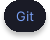

<table width="100%">
  <tr>
    <td width="47%" valign="center">
      

         
      
 
      

        
        

      

Building full-stack web and mobile applications with **Next.js**, **React Native**, **Express**, and **TypeScript**.

Interested in backend development, API design, software architecture,
and building maintainable systems.

Enjoy designing intuitive UIs and connecting them with scalable backend
services.

Currently learning system design, design patterns, microservices, and
modern software engineering practices.

Continuously improving my projects while exploring new technologies,
tools, and best practices.

</td>

<td width="53%" valign="top">

  

 
Full-stack e-commerce platform built with a microservices architecture
featuring authentication, product management, shopping cart, orders,
and event-driven communication.

 
Mobile app for managing personal book collections with ISBN scanning,
borrowing & lending, friends, notifications, and library organization.

 
Mobile news app for exploring topics, reading articles, and getting
concise AI-powered summaries to quickly catch up on the latest news.

</td>
  </tr>
</table>

---

   

 

  

  

  

  

  

---

   

 

  
  

