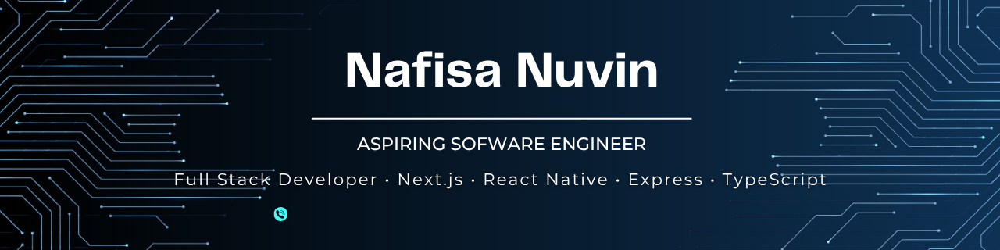

<!--
# Welcome, I'm Nuvi

### Full Stack Developer • Next.js • React Native • Express • TypeScript 
-->

<!-- 

  

  -->

<!--

  

  

-->

<table width="100%">
<tr>

<td width="47%" valign="center">
  
<h3 align="center"> About me </h3>

* Building full-stack web and mobile applications with **Next.js**, **React Native**, **Express**, and **TypeScript**.
* Interested in backend development, API design, software architecture, and building maintainable systems.
* Enjoy designing intuitive UIs and connecting them with scalable backend services.
* Currently learning system design, design patterns, microservices, and modern software engineering practices.
* Continuously improving my projects while exploring new technologies, tools, and best practices.

 
<!--
-->
</td>

<td width="53%" valign="top">

 
<!-- <h3 align="center"> Featured Projects </h3> -->

<!-- <h5><b> E-Commerce Platform </b></h5> -->

<!-- -->

Full-stack e-commerce platform built with a microservices architecture featuring authentication, product management, shopping cart, orders, and event-driven communication.

---

<!-- <h5><b> BookQuest </b></h5> -->

<!--  -->

Mobile app for managing personal book collections with ISBN scanning, borrowing & lending, friends, notifications, and library organization.

  
 

<!-- ---

#### **AI Chat App**

AI chat application powered by Gemini API with real-time conversations and chat history.

 
-->

</td>

</tr>
</table>

---
<h3 align="center"> Tech Stack </h3>

<b>Languages</b> 

<b>Frontend & Mobile</b> 

<b>Backend</b> 

<b>Databases & ORM</b> 

<b>AI & Data</b> 

<b>Tools & DevOps</b> 

---
<h3 align="center"> GitHub Stats </h3>

  <!--   -->
  
   

---

<h3 align="center"> Contribution Graph </h3>

  

